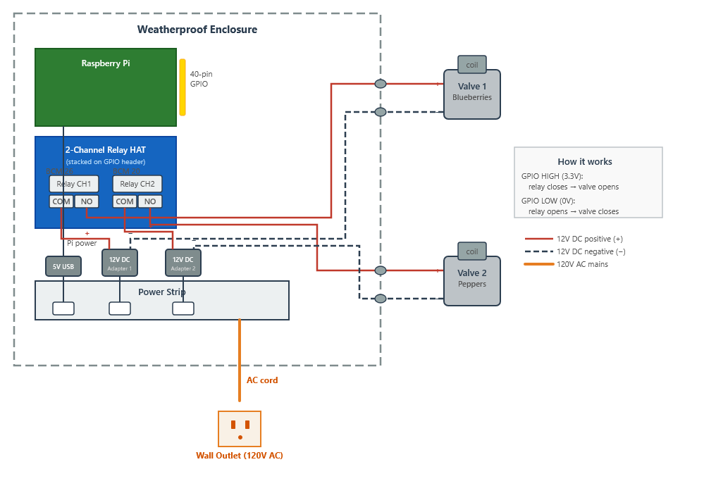
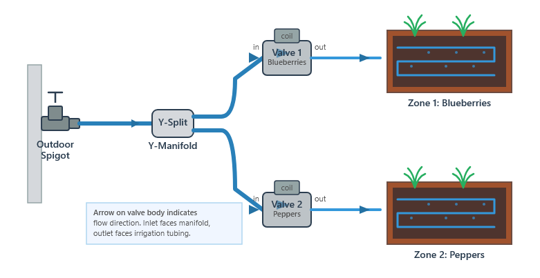

# Hardware Setup

This guide covers the full hardware setup for the irrigation system: parts, wiring, plumbing, and assembly.

## Parts List

| Component | Qty | Notes |
|---|---|---|
| Raspberry Pi (any model with 40-pin GPIO header) with power supply, case, SD card, etc.| 1 | Pi 3B+, 4, or 5 all work. Must have WiFi capability and an internet connected network in-range for weather API. |
| Multi-channel relay HAT for Raspberry Pi | 1 | Generic stacking HAT with at least 2 relay channels. Must be controllable via GPIO. [This one](https://www.amazon.com/dp/B07CZL2SKN) has done well over the course of 2 years. |
| 12V DC normally-closed solenoid valve | 1+ | One per irrigation zone. 3/4" thread is standard for garden hose fittings. [The US Solid brass valves](https://www.amazon.com/dp/B00DQ1J4H0?th=1) work well but they require some yearly maintenance|
| 12V DC power adapter | 1+ | Check the amperage rating on your valves to make selection.  [These](https://www.amazon.com/dp/B077PW5JC3) are pretty good. |
| Garden hose Y-manifold / splitter | 1 | Splits the supply line to feed each valve. Use a manifold with as many outlets as you have valves. [This](https://www.amazon.com/dp/B01N9QQCJP) along with [these](https://www.amazon.com/dp/B08W9M4WBX) have been good. |
| Garden hose to 3/4" thread adapters | As needed | To connect hose fittings to the solenoid valve inlets. [These](https://www.amazon.com/dp/B087GCQSTN) are good.|
| Drip line / soaker hose / sprinkler tubing | Per zone | Whatever delivers water from each valve to the plants. |
| Weatherproof enclosure | 1-2 | Large enough for the Pi + relay HAT. IP65 or better for outdoor use. You may also optionally get another one to house the valves. [Variations of this](https://www.amazon.com/dp/B0BZR2XK7P) worked well for me.|
| Cable glands | As needed | For routing wires into the enclosure while keeping it sealed. Most enclosures come with a few.|
| 18 AWG stranded wire (2-conductor) | ~10-20 ft | For wiring the 12V DC circuit from the relay outputs to each valve. |
| Wire connectors (lever nuts, wire nuts, or waterproof splice connectors) | As needed | For joining valve leads to the relay wiring. Waterproof connectors recommended for outdoor runs. |
| Power strip | 1 | Housed inside the enclosure. Supplies AC power to the Pi power supply and all 12V adapters. Any outdoor strip that can fit in the enclosure and can fit all adapters simultaneously will do. |

## Wiring

### How the relay HAT works

The relay HAT stacks directly onto the Pi's 40-pin GPIO header. Each relay channel is mapped to a specific GPIO pin. When the Pi drives a GPIO pin HIGH, the corresponding relay closes, completing the 12V DC circuit and opening the solenoid valve. When the pin goes LOW, the relay opens and the valve closes.

### Pin mapping

The default configuration in `config_sample.json` uses these pins:

| Valve | Name | BCM Pin | Physical Pin | Relay Channel |
|---|---|---|---|---|
| 1 | blueberries | 26 | 37 | CH1 |
| 2 | peppers | 20 | 38 | CH2 |

Pin numbers use **BCM numbering** (the `pinctrl` / `gpio` convention), not physical header position. The physical pin column is provided for reference when visually locating pins on the header.

Consult your relay HAT's documentation to determine which GPIO pins it exposes as relay-control pins. You may need to adjust the `pin` values in `config.json` to match the pins your HAT uses.

### 12V DC valve circuit

Each valve circuit is wired through one relay channel. When the relay is energized (GPIO HIGH), the COM and NO terminals connect, completing the circuit and opening the valve. When the relay is de-energized (GPIO LOW), the circuit is broken and the normally-closed valve shuts off water flow.

### Step-by-step wiring

1. **Stack the relay HAT** onto the Pi's 40-pin GPIO header. Ensure all pins seat fully.

2. **Set up the power strip** inside the enclosure. Plug in the Raspberry Pi's USB power supply and one 12V DC adapter per valve.

3. **Wire each adapter through its relay channel to its valve:**
   - Run the positive (+) wire from 12V Adapter 1 to the **COM** (common) terminal on relay channel 1.
   - From the **NO** (normally open) terminal of channel 1, run a wire out through a cable gland to the positive lead of Valve 1 (blueberries).
   - From the negative lead of Valve 1, run a wire back through the cable gland to the negative (-) terminal of 12V Adapter 1.
   - Repeat with 12V Adapter 2, relay channel 2, and Valve 2 (peppers).

4. **Secure all connections** with appropriate connectors. Use waterproof splice connectors or heat-shrink solder connectors for any joints that will be exposed to moisture.
## Plumbing

### Water supply

1. **Connect a garden hose** from your outdoor spigot/faucet to the inlet of the manifold.

2. **Attach the manifold** to split the supply. Use a Y-splitter for 2 zones or a multi-port manifold for more.

3. **Connect each manifold outlet to a solenoid valve inlet.** Use appropriate hose-to-thread adapters if needed. Wrap threads with Teflon tape to prevent leaks.

4. **Connect drip line or soaker hose** to each valve's outlet, routing it to the corresponding plant zone.

5. **Turn on the water supply** and check every fitting for leaks before powering on the system.

### Valve orientation

Solenoid valves are directional. An arrow on the valve body indicates flow direction. Make sure the inlet side faces the water supply (manifold) and the outlet side faces the irrigation tubing.

### Draining

If you are in a climate with freezing winters, disconnect and drain the valves and lines before the first frost to prevent cracking.

## Enclosure

1. **Choose a weatherproof enclosure** (IP65 or better) large enough to hold the Pi with the relay HAT stacked on top, plus room for wire routing.

2. **Mount the Pi** inside using standoffs or a DIN rail adapter.

3. **Route wires through cable glands** installed in the enclosure walls. You will need entry points for:
   - Power strip AC cord (to an outdoor outlet)
   - Valve wiring (one 2-conductor run per valve, from the relay terminals to each valve)

4. **Seal all cable glands** tightly. Apply silicone sealant around any remaining gaps if the enclosure will be exposed to rain.

5. **Mount the enclosure** near the water supply, on a wall, post, or fence. Keep it out of direct sprinkler spray and off the ground to avoid pooling water.

## Pin Reference

Quick reference mapping `config.json` pin values to the Raspberry Pi 40-pin header:

| BCM Pin | Physical Pin | Board Location |
|---|---|---|
| 20 | 38 | Row 19, right side |
| 26 | 37 | Row 19, left side |

These two pins are adjacent on the header (row 19), which is convenient for short jumper runs on HATs that let you select which GPIO controls each channel.

For a full 40-pin header pinout, see https://pinout.xyz/.
